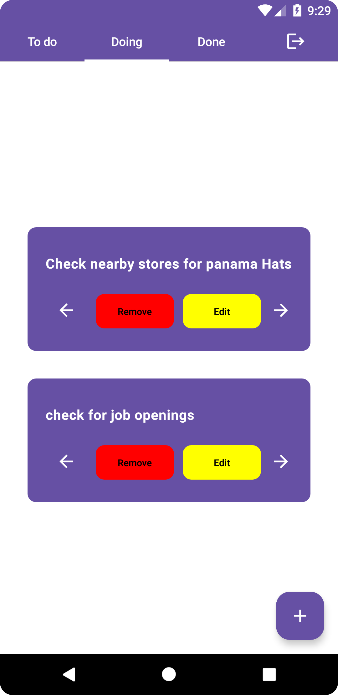
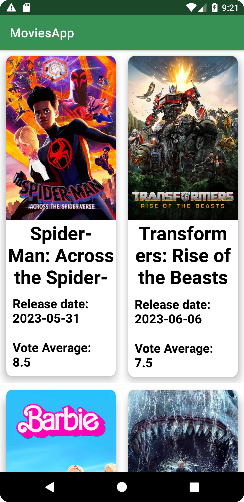

### Hello there!/Olá!👋
Hi! My name is Vinicius Santos, I´m mobile developer with some game development experience. Currently, I'm 25y/o and studying Computer Science in Centro Federal de Educação Tecnologica Celso Suckow da Fonseca, also known as CEFET/RJ.
My goal is to become a better professional, always learning and thriving. And, also, land a new job experience as mobile developer  

# ✨Contact 
 <br>
  <a href="https://wa.me/+5521990399627"></a>
  <a href="https://www.linkedin.com/in/vinicius-santos-b217b5168/"></a>
  <a href="mailto:viniciusantos0898@gmail.com"></a><br>
  <a href='https://play.google.com/store/apps/developer?id=N0stalgiaUltra&pcampaignid=pcampaignidMKT-Other-global-all-co-prtnr-py-PartBadge-Mar2515-1'></a>

# 🧠 Knowledge:

```kotlin
object N0stalgiaUltra {
 val name = "Vinicius Tavares"

 val primarySkillset = "Android Developer"
 val languages = listOf("Kotlin", "C#", "Java")
 val mobileTechStack = listOf("Android SDK", "Android Jetpack",
                      "API RESTful", "MVVM", "Clean Arch",
                      "Unit and Instrumented Testing", "XML", "Compose")

val secondarySkillset = "Game Developer"
val language = "C#"
val gamesTechStack = listOf("Unity", "Unity Cloud Build",
                            "Mobile Games", "Serious Games",
                            "Educational Games", "Design Patterns")
 
}
```

<br>


# ⭐ Current Projects: 
- [PetJournal](https://github.com/N0stalgiaUltra/petjournal.android) 
- [AchaCep](https://github.com/N0stalgiaUltra/AcheseuCEP)


# 🌱 Recent Projects:

<a href="https://github.com/N0stalgiaUltra/Head2HeadApp">   </a> 
<a href="https://github.com/N0stalgiaUltra/TaskControlApp">   </a> 
<a href="https://github.com/N0stalgiaUltra/NotesApp/tree/main">   </a> 
<a href="https://github.com/N0stalgiaUltra/MoviesAPP">   </a> 

